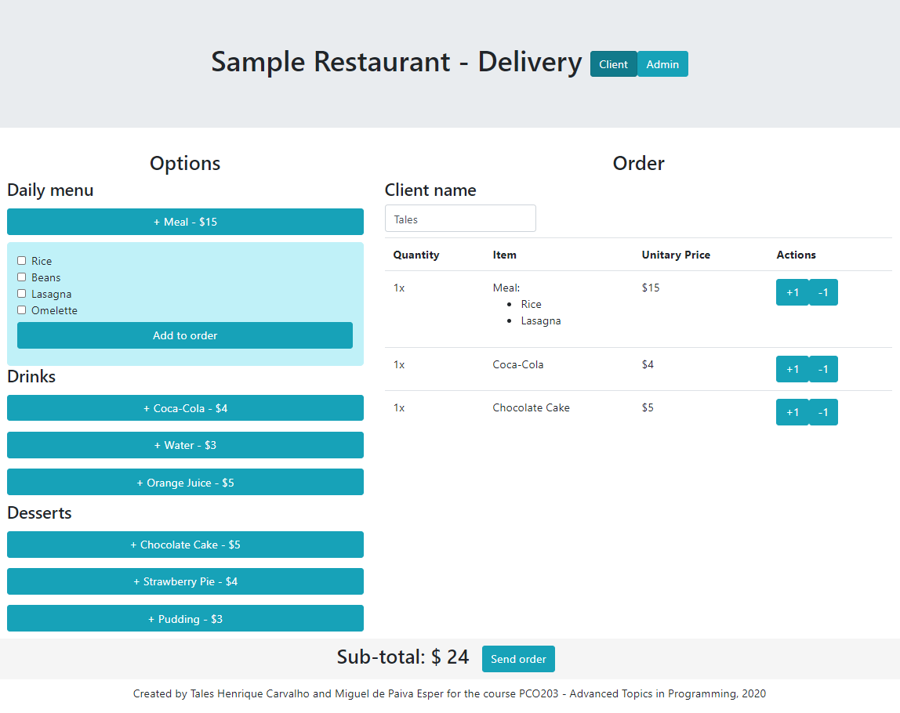

# Food Delivery Project

This is a web application project built to manage orders in a sample restaurant. It has a user interface for placing orders and an admin interface for managing existing orders. The restaurant data is managed through a MongoDB database that is created and maintained in the server side. This project was built with the MEAN stack (MongoDB / Express / Angular / NodeJS) architecture.



# Instalation

## Server side

Copy the server folder to the system (preferably a 64-bit Ubuntu Server) that will run the server side of the application. Make sure that MongoDB is installed and running on port 27017 through [this guide](https://docs.mongodb.com/manual/tutorial/install-mongodb-on-ubuntu/). Afterwards, install NodeJS and NPM:

```
$ sudo apt update
$ sudo apt install nodejs npm
```

Now go to food-delivery/server folder to install and run the server side of the application:

```
$ npm install
$ npm install -s mongodb
$ npm install -s mongoose
$ npm start
```

These commands will start the application and will create the required collections in the database. If you see the message "Server initialized.", the server is working properly and you can go to the next section.

## Client side

In your workstation, make sure you have NodeJS and Angular/CLI installed:

```
$ sudo apt update
$ sudo apt install nodejs npm
$ sudo npm install -g @angular/cli
```

Go to food-delivery/client folder. Install the required packages with the following command:

```
$ npm install
```

Now you can either run the server in test mode with the command below:

```
$ ng serve --open
```

Or you can generate a production webpage with the following command:

```
$ ng build --prod
```

The generated website will be located under the dist/food-delivery-client folder, and has to be copied to a web server strcuture (such as Apache).

# Usage

Make sure the server side application is running (`$ npm start` command in server folder) and that the Angular application is either running in test mode (`$ ng serve` command in client folder) or in production mode (refer to previous section).

Open your browser in http://localhost:4200/ to open the application. The client window will show up, where you can place your desired orders. To access the admin window, select it in the upper menu.

# Project details - Client side

## Angular Components

| Component Name |  Route |                      Description                      |
|:--------------:|:------:|:-----------------------------------------------------:|
| Client         | /      | Where users can place their orders in the restaurant  |
| Admin          | /admin | Where restaurant employees can manage client's orders |

## Angular Classes

|   Name  | Structure                                                                                                                                                     | Description                                                     |
|:-------:|---------------------------------------------------------------------------------------------------------------------------------------------------------------|-----------------------------------------------------------------|
| Food    | Name: String,<br/> Selected: Boolean                                                                                                                          | Describes a food option of the restaurant.                      |
| Meal    | FoodList: Array&lt;Food&gt;,<br/> Price: Number,<br/> Quantity: Number                                                                                        | Describes a meal ordered by a client.                           |
| Drink   | Name: String,<br/> Price: Number,<br/> Quantity: Number                                                                                                       | Describes a drink option of the restaurant.                     |
| Dessert | Name: String,<br/> Price: Number,<br/> Quantity: Number                                                                                                       | Describes a dessert option of the restaurant.                   |
| Menu    | Menu: {FoodList: Array&lt;Food&gt;, Price: Number},<br/> DayWeek: Number,<br/> Drinks: Array&lt;Drink&gt;,<br/> Desserts: Array&lt;Dessert&gt;                | Describes the menu offered by the restaurant during a work day. |
| Order   | Client: String,<br/> Meals: Array&lt;Meal&gt;,<br/> Drinks: Array&lt;Drink&gt;,<br/> Desserts: Array&lt;Dessert&gt;,<br/> Delivered: Boolean,<br/> Date: Date | Describes an order placed by a restaurant client.               |

# Project details - Server side

## Routes

| HTTP Request Type |  Route | Description                                      |
|:-----------------:|:------:|--------------------------------------------------|
| GET               |  /menu | Returns the menu of the current week day.        |
| POST              | /order | Places an order created by a client.             |
| GET               | /order | Returns all orders placed in the current day.    |
| PATCH             | /order | Sets a given order's Delivered variable to true. |

## MongoDB Structure

| Collection | Schema                                                                                                                                                                                                                                                                                 | Description                                                         |
|:----------:|----------------------------------------------------------------------------------------------------------------------------------------------------------------------------------------------------------------------------------------------------------------------------------------|---------------------------------------------------------------------|
| Drinks     | Name: String,<br/> Price: Number                                                                                                                                                                                                                                                       | Lists all drink options of the restaurant.                          |
| Desserts   | Name: String,<br/> Price: Number                                                                                                                                                                                                                                                       | Lists all dessert options of the restaurant.                        |
| Menus      | FoodList: [{Name: String}],<br/> DayWeek: Number,<br/> Price: Number                                                                                                                                                                                                                   | Describes the menus offered by the restaurant during each week day. |
| Orders     | Client: String,<br/> Meals: [{FoodList: [{Name: String}], Price: Number, Quantity: Number}],<br/> Drinks: [{Name: String, Price: Number, Quantity: Number}],<br/> Desserts: [{Name: String, Price: Number, Quantity: Number}],<br/> Delivered: Boolean,<br/> Date: Date, Price: Number | Lists orders placed by restaurant clients.                          |